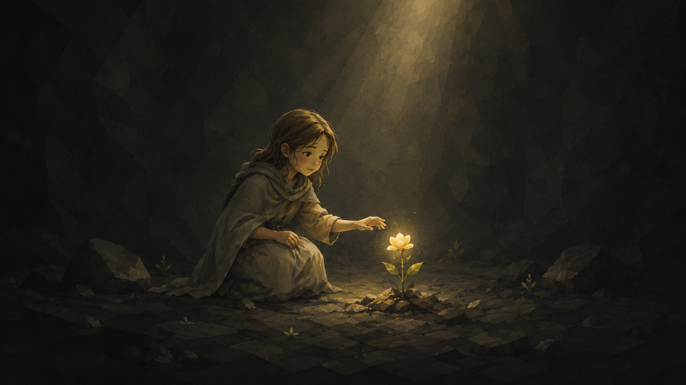

# Nature of Hope — an Omarchy Kids theme

A calm, cozy **dark** theme for kids: the warm, earthy **Miasma** palette paired with OldJobobo's kid-safe "nature of hope" wallpapers — a child discovering a glowing flower, and a small friend cupping a glowing butterfly, in a quiet cave lit by a single warm light. Gentle wonder, not spooky.



> The preview is a placeholder (the wallpaper itself). Replace it with a real desktop screenshot after installing.

## Install

```bash
omarchy-theme-install https://github.com/kenhara/omarchy-nature-of-hope-theme
```

While this repo is private (pre-review), install over SSH instead:

```bash
omarchy-theme-install git@github.com:kenhara/omarchy-nature-of-hope-theme.git
```

Then choose **Nature of Hope** in the Omarchy theme picker.

## What's inside

- `colors.toml` — the **Miasma** palette, reused verbatim (`mode = "dark"`)
- `backgrounds/` — kid-safe wallpapers: `the-nature-of-hope-flower.png`, `the-nature-of-hope-wallpaper.png`
- `icons.theme` — `Yaru-wartybrown`
- `unlock.png` — lock-screen background

Nothing here is invented: the colors are an existing Omarchy palette, and the only new material is the reviewed kid wallpapers. See [`NOTES.md`](NOTES.md) for the full rationale.

## Credits

- **Wallpapers & visual design:** OldJobobo
- **Palette:** reused from Omarchy's **Miasma** theme
- **Draft implementation:** Harris / kenhara
